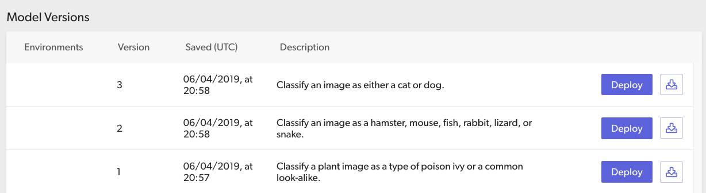

# CoreML Phrase Generator iOS App
 

This iOS application uses a [CoreML]() model to predict likely next words in a phrase given some seed text. The model runs on-device, which is optimal for the user experience.

### About the Model
The `PhraseGenModel.mlmodel` included in the app bundle was trained on text
from **Presidential Inaugural Addresses** over the last ~40 years. In the `model-building/` section, you should have trained your own model in the style of **William Shakespeare**.

## Requirements

*   Device with iOS 12.0 or above
*   Xcode 10.0 or above
*   Valid Apple Developer ID
*   Xcode command-line tools (run `xcode-select --install`)
*   [CocoaPods](https://cocoapods.org/) (run `bash sudo gem install cocoapods`)

If this is a new install, you will need to run the Xcode application once to
agree to the license before continuing.

## Build and Run

1.  Clone this GitHub repository to your workstation.
```bash
git clone https://github.com/skafos/example-ml-apps.git
```

2.  Install the pod to generate the workspace file:
```bash
cd example-ml-apps/Keras/coreml/ios/app/ && pod install
```

_Note: If you have installed this pod before and that command doesn't work, try
`pod update`._

3. At the end of this step you should have a file called
`PhraseGenerator.xcworkspace`. Open the Xcode workspace:
```bash
open PhraseGenerator.xcworkspace
```

4.  Select the `PhraseGenerator` project in the left hand navigation to open
    the project configuration. In the **Signing** section of the **General**
    tab, select your development team from the dropdown.

5.  In order to build the project, you must modify the **Bundle Identifier** in
    the **Identity** section so that it is unique across all Xcode projects. To
    create a unique identifier, try adding your initials and a number to the end
    of the string.

6. Add your Skafos **Environment Keys** to the `AppDelegate.swift` file.

7. With an iOS device connected, clean (`cmd + k` and `cmd + shift + k`),
build and run (`cmd + R`) the app in Xcode.

**The app should build and install on your test device with the INITIAL model.**

## Update the Model
1. Make sure you have a new model to deploy! Build one here if you haven't already: [](https://colab.research.google.com/github/skafos/example-ml-apps/blob/master/Keras/coreml/ios/model-building/phrase_generator_model.ipynb)

2. Go to the <a href="https://dashboard.skafos.ai" target="_blank">**Skafos Dashboard**</a>, navigate to the App, and then the `PhraseGenModel` that you made to go with this app integration.

3. You should see the model you just delivered in the dashboard. Click the "Deploy" button to deliver it to your Dev environment.



4. You will need to stop and re-run your application in XCode. Then you will see the model predictions change to reflect the newly delivered model! It may take a few seconds depending on network speed.

*Congratulations - you've just deployed your first Skafos model version to an app!*
