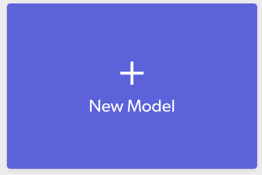

# Example ML Apps

*We are committed to building a platform that integrates with popular Machine Learning (ML) training frameworks & on-device ML formats, to create the best possible user experience delivering models to the edge.*

With the wide array of tools and technologies available, **it is challenging to develop an end-to-end machine learning architecture for mobile ML deployment**.

## Overview
In this repository, we're assembling example workflows that demonstrate all parts of the end-to-end pipeline: *model training*, *delivery*, and *mobile app integration*.

**Each example features**:
- A task oriented ML use-case
- An [ML Training Framework](#ml-training-frameworks) & [On-Device ML Format](#on-device-ml-formats) (*see description below*)
- <a href="https://dashboard.skafos.ai" target="_blank">Skafos</a> for model updates, management, and monitoring

**Each example includes**:
- Model training code (*Jupyter Nobetook*) that can be run on [Google Colab](https://colab.research.google.com/)
- A mobile app that that demonstrates model integration and delivery runnable in [Xcode](https://developer.apple.com/support/xcode/)

### ML Training Frameworks
These are libraries you would use to train machine learning models: anything from neural networks to decision tree classifiers. This is absolutely **NOT** an exhaustive list. More will be documented here over time.

- [**TensorFlow**](https://www.tensorflow.org/)
- [**Keras**](https://keras.io/)
- [**TuriCreate**](https://github.com/apple/turicreate)
- [**PyTorch**](https://pytorch.org/)
- [**Caffe**](https://caffe.berkeleyvision.org/)

### On-Device ML Formats
Once you've trained a machine learning model, **you have to convert it to a format optimized for use on mobile**. The two most popular formats are:

- [**CoreML**](https://developer.apple.com/documentation/coreml) (iOS only)
- [**TFLite**](https://www.tensorflow.org/lite)

## Available Examples
Our collection of example machine learning apps will continue to grow over time:

- [**TensorFlow -> TFLite: Image Classification iOS**](https://github.com/skafos/example-ml-apps/tree/master/TensorFlow/tflite/ios)
  - **ML Use-Case**: Image Classification
  - **ML Training Framework**: TensorFlow
  - **On-Device ML Format**: TFLite
- [**Keras -> CoreML: Phrase Generation iOS**](https://github.com/skafos/example-ml-apps/tree/master/Keras/coreml/ios)
  - **ML Use-Case**: Natural Language Processing: Text Generation
  - **ML Training Framework**: Keras
  - **On-Device ML Format**: CoreML

## Getting Started
First, clone this repo:
```bash
$ git clone git@github.com:skafos/example-ml-apps.git
```

Then, navigate to the example you want to try and checkout the README doc for further instruction:
```bash
$ cd example-ml-apps/TensorFlow/tflite/ios
$ more README.md
```

## How To Best Use These Examples
Feel free to look around and explore as you wish! However we recommend following these steps for each example you try:

1. <a href="https://dashboard.skafos.ai" target="_blank">Create a free Skafos account</a> and login
2. In the dashboard, create a new app integration and model for the example




3. Go through the model training and upload example code
4. Go through the app building steps to see the ML model in action and Skafos perform model updates

___

## Questions? Need Help?

Please don't hesitate to reach out!

-  [Check out our platform documentation](https://docs.skafos.ai), complete with FAQs
-  [Signup for our Slack Channel](https://join.slack.com/t/metismachine-skafos/shared_invite/enQtNTAxMzEwOTk2NzA5LThjMmMyY2JkNTkwNDQ1YjgyYjFiY2MyMjRkMzYyM2E4MjUxNTJmYmQyODVhZWM2MjQwMjE5ZGM1Y2YwN2M5ODI)
-  [Find us on Reddit](https://reddit.com/r/skafos)
-  Submit an issue to this github repo and we will address it
