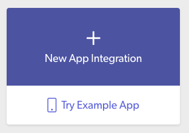

# TensorFlow & Skafos on iOS
 

In this example, you will see how to train an **Image Classification**
model with [**TensorFlow**](www.tensorflow.org), convert it to **Core ML** format, and deploy it to an
iOS application with <a href="https://dashboard.skafos.ai" target="_blank">**Skafos**</a>.

## Setup
Before you do any further setup, make sure you've cloned this repository:
```bash
$ git clone git@github.com:skafos/example-ml-apps.git
$ cd example-ml-apps/TensorFlow/coreml/ios
```

1. Go to the <a href="https://dashboard.skafos.ai" target="_blank">Skafos Dashboard</a> and login or create a free account.
2. Click the link to create a **New App Integration**.



3. Give the app a name like `ImageClassificationCoreML` (or something similar).
4. Create a new model called `ImageClassifier`.

Now you're all setup to upload model versions and deploy to an iOS app from the dashboard!

### 1. Model Building
We've provided some Python ([TensorFlow](https://tensorflow.org)) training code that you can use to build an image classification model to identify common pets using our open source CLI, [Parago](https://github.com/skafos/parago-cli), with very little hassle. The [original training code](https://github.com/tensorflow/hub/raw/master/examples/image_retraining/retrain.py) was written by TF, but we adapted it just for you!
While training, you can visualize ongoing accuracy and loss metrics in your browser.

1. [Download Parago](https://www.npmjs.com/package/parago)
```bash
$ npm install -g parago
```

2. Create a new TensowFlow Image Classifier project from the generator (`-g`):
```bash
$ pgo create myimageclassifier -g tf-image-classifier
$ cd tf-image-classifier/
$ conda env create -f environment.yml && conda activate tf-image-classifier
```

3. Load the pets dataset:
```bash
$ pgo data load --env data_src=more_pets
```

4. Train the model:
```bash
$ pgo train --env epochs=100
```

5. Visualize training progress in your browser. In a new terminal window with the same conda env activated:
```bash
$ pgo run watch
```

6. Export the model to Core ML format:
```bash
$ pgo export
```

7. Once done, deploy (upload) the model to Skafos:
```bash
$ pgo deploy
```
*You will be prompted to enter your Skafos API Token, Org Name, App Name, and Model Name*

**Some important notes:**
- The model is trained to classify an animal image into one of 6 categories: Fish, Hamster, Lizard, Mouse, Rabbit, Snake
- Your **Skafos API Token** can be found on the Account Settings page on the [dashboard](https://dashboard.skafos.ai)
- Check the project's `parago.yml` and `README.md` file to see a list of all available environment options for the different commands
- Want to make your own? Just replaced the image subfolders in the `data/` directory with your own images

### 2. iOS App
We've provided a pre-packed Xcode project for you to work with. All project contents can be found in the `app/` subdirectory. We've integrated the [Skafos iOS Framework](https://github.com/skafos/ios) to handle model updates over-the-air.

Make sure you have the following requirements satisfied:

- Device with iOS 12.0 or above
- Xcode 10.0 or above
- Valid Apple Developer ID
- Xcode command-line tools (run `xcode-select --install`)
- CocoaPods (run `sudo gem install cocoapods`)

Follow the [Build & Run: Step-By-Step Instructions](app/README.md#build--run-step-by-step-instructions) to build the app!

Some important notes:
- The initial model pre-bundled in the app is trained to classify animal images as either a "Cat" or a "Dog".
- With Skafos, you can deploy your newly trained image classifier (from above).
- Grab your **Environment Keys** for Dev and Prod from the App Settings page on the <a href="https://dashboard.skafos.ai" target="_blank">dashboard</a>. Need help? See the [Integration Guide](https://docs.skafos.ai/sections/integrate.html) for more details here.
-----

## Questions & Issues?
See our [Documentation](https://docs.skafos.ai), [FAQs](https://docs.skafos.ai/sections/faq.html), other examples in this repo, and [join our Slack Community](https://skafosai.slack.com/join/shared_invite/enQtNTAxMzEwOTk2NzA5LThjMmMyY2JkNTkwNDQ1YjgyYjFiY2MyMjRkMzYyM2E4MjUxNTJmYmQyODVhZWM2MjQwMjE5ZGM1Y2YwN2M5ODI)!

If you still can't find what you need, please open an issue on this repo and we will address it.
